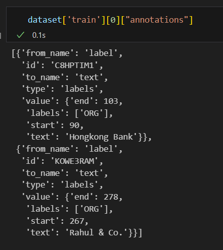
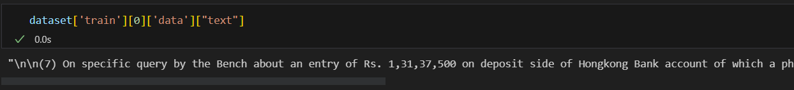
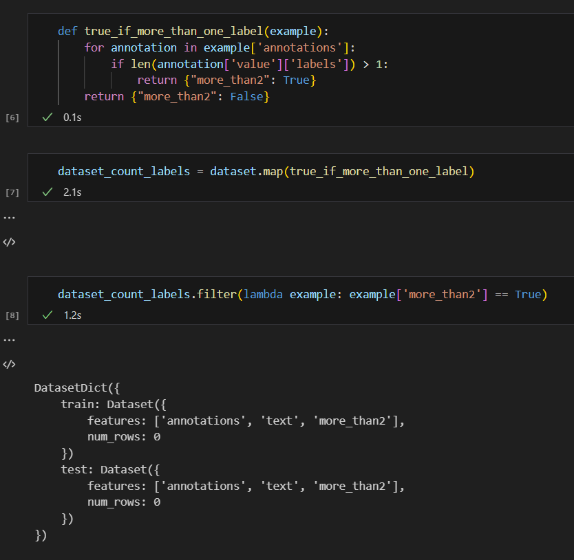

# NLP-Legal-eval

At first clone the repo and install our module

```shell
    git clone https://github.com/SebChw/NLP-Legal-eval.git
    cd NLP-LEGAL-EVAL
    pip install -e .
```

## API serving the best spacy models
If you have GPU you should download GPU RoBERTa weights [here](https://shorturl.at/cIJSV)

You can run the app navigating to app/ directory and running gunicorn server
    
```shell
    cd app
    gunicorn wsgi:app 
```

Then you can make two types of api call: \
`process` - Just process the text and return the result \
`process_vizualize` - Returns an HTML file with nice spacy vizualization

```shell
curl -X POST -H "Content-Type: application/json" -d '{"text": "The next contention revolves around the role of the AICTE and the decision of the Supreme Court in Bharathidasan University."}' http://127.0.0.1:8000/process_vizualize > visualization.html
```
or just
```shell
curl -X POST -H "Content-Type: application/json" -d '{"text": "The next contention revolves around the role of the AICTE and the decision of the Supreme Court in Bharathidasan University."}' http://127.0.0.1:8000/process
```

##Docker

You can also use the API without installing anything. Just build and run docker container.

```shell
docker build  -t legal_eval_gpu .
docker run --gpus all -p 8000:8000 legal_eval_gpu
```

Just remember to place your best GPU model in ```/legal_eval/spacy/gpu-RoBERTa/output/model-best``` 

## Development

To download and load the data

```py
    from legal_eval.data import download_data, get_hf_dataset
    
    DATA_PATH = Path("../data")

    download_data(DATA_PATH)
    dataset = get_hf_dataset()
```


annotations are in format like this (I unnested them!)



Text is just plain text 



I checked it and actually no word has more than 1 label. WHY THEY USED LIST GOD.



I wrote function that formats this dataset
```py
from utils import parse_to_ner
dataset_ner = parse_to_ner(dataset) 
```

So eventually you work with something like this. `I splitted the text as it is necessary for hugging face evaluator.` I know it's weird


If you prefer integers over string as `ner_tags` run
```py
from utils import cast_ner_labels_to_int
casted = cast_ner_labels_to_int(dataset_ner['train'])
```

After this you can easily take int2str and str2int functions from the ClassLabel feature that was created

```py
casted.features['ner_tags'].feature.int2str(1)
casted.features['ner_tags'].feature.str2int(1)
```


**For evaluation we use HF evaluate library** Any model or pipeline should follow it's API. [Check this](https://huggingface.co/docs/evaluate/v0.4.0/en/custom_evaluator) to implement custom Pipeline. Check `baselines.py` and `test_stuff.ipynb` for an example of Simple Baseline with API good enough for HF evaluator.

`Suggestion: Maybe we can try to use Spacy for this?`


### Preparing fasttext embeddings
Installing fasttext

```shell
git clone https://github.com/facebookresearch/fastText.git
pip install fastText
```

Run model creation

```py
from utils import create_fasttext_model

create_fasttext_model(dataset_ner['train'], "legal_eval.bin")
```

### Preparing labels for transformers

For transformers labels are matched to tokens using the following function. It assigns all tokens in a label interval a label from this interval.

```shell
from utils import parse_to_ner_custom_tokenizer
dataset_ner = parse_to_ner_custom_tokenizer(dataset, tokenizer)
```

### Transformers
To train distillbert model simply run:

```shell
python -m legal_eval.transformers.train
``` 

To test it modify model checkpoint path and run

```shell
python -m legal_eval.transformers.test
```

### SpaCy models

To train spacy model you need to have spacy installed and run

```shell
python -m spacy train cpu_final.cfg --output ./output --paths.train ./train.spacy --paths.dev ./dev.spacy
```

If you are on GPU you make replace `cpu_final.cfg` with `gpu_final.cfg`.

### GPT
Generative models were not designed to solve NER tasks, but nowadays they are used for everything so let's give them a chance.

You can use them providing your `OPENAI_API_TOKEN` in system variables.
Then you may run the legal_eval/GPT/openai.ipynb notebook to see how it works.
